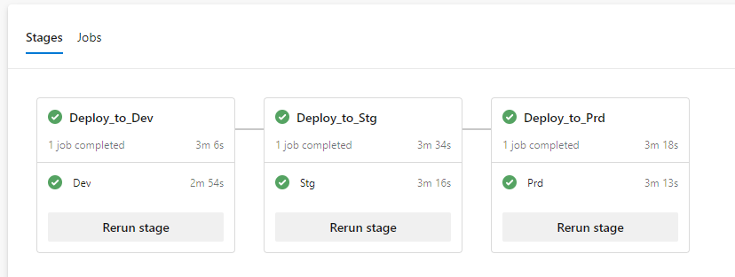
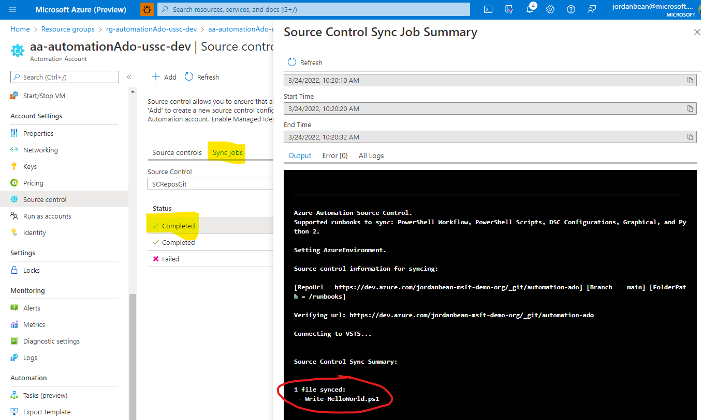

# automation-ado

This demo shows how to set up an Azure DevOps Continuous Deployment (CD) pipeline for deploying an Azure Automation account & associated Runbooks.

## Deployment

1.  Clone the repo & upload into your own Azure DevOps instance.

1.  Modify the `/ado/env` & `/infra/env` files to match your Azure & Azure DevOps environment.

1.  Select the `Pipelines` blade in Azure DevOps and click on `New pipeline`

1.  Select where your have stored your source code, select `Existing Azure Pipelines YAML file`, select the Branch (likely `main`) and set the Path to `/ado/deploy-automation.yml`.

1.  `Save` the pipeline.

1.  In the upper right-hand corner of the screen, select the `User Settings` button and select `Personal Access Tokens`. This PAT will be used by the Azure Automation account to pull the runbooks from source control.

1.  Click `New Token`, give it a name that reminds you what it will be for (example: `AzureAutomation`). Set the Expiration. Add the following [scopes](https://docs.microsoft.com/en-us/azure/automation/source-control-integration#minimum-pat-permissions-for-azure-devops) (click on the `Custom defined` radio button to see them all).
    1.  Code - Read
    1.  Identity - Read
    1.  Project and Team - Read
    1.  Service Connections - Read, query, & manage
    1.  User Profile - Read
    1.  Work Items - Read

1.  Copy the PAT to Notepad.

1.  Navigate back to the pipeline and click on `Edit`.

1.  Click `Variables` and then `New variable`.

1.  Name the variable `AdoPat`, paste in the PAT string you copied earlier & check the `Keep this value secret` checkbox. Click `Ok` to save.

1.  Click `Run pipeline` to execute. You may need to `authorize` the pipeline to use the service connection. This initial run will create all of the required Azure resources & set up the sync, but it will fail the first time becuase you need to grant the Managed Identity that the Automation Account uses `Contributor` access to the Resource Group so it can create `Runbook` resources (https://docs.microsoft.com/en-us/azure/automation/source-control-integration#prerequisites).

1.  In the [Azure portal](https://portal.azure.com), navigate to your Resource Group. Click on the `Access control` blade. Click on `Add->Add Role assignment`.
    1.  Select the `Contributor` role. Click `Next`.
    1.  Select the `Managed identity` radio button. Click `Select members`.
    1.  Select the managed identity that was created in your resource groups. Click `Select.
    1.  Click `Review + assign`.

1.  Run the pipeline again to see the sync occur.

You can now see the Azure Automation Source Control link & Runbook sync job complete in the Azure portal.

